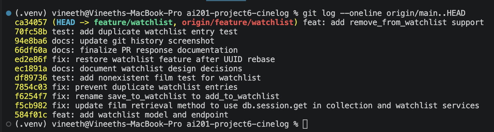

# PR Response Doc — CineLog Watchlist Feature

## AI Usage

I used AI to review my implementation approach, verify that my commit messages followed the Conventional Commits format, and refine the wording of my responses in `pr-response.md`. I also used AI to review my final work against the project guidelines and grading rubric to confirm that all required review comments, documentation, and Git history requirements were addressed.

I read the codebase myself before implementing the requested changes and used AI as a verification and writing aid rather than as a replacement for understanding the implementation.

## Comment 1 – Rename

**What I did:**
Renamed `save_to_watchlist()` to `add_to_watchlist()` in `services/watchlist_service.py` to follow the project's `verb_to_noun` naming convention. I also updated the import and function call in `routes/watchlist/watchlist.py` so they reference the new function name consistently.

**How I verified:**
I performed a project-wide search for `save_to_watchlist` to identify every call site and confirmed there were no remaining references after the rename. I then ran the test suite to verify that the rename did not break existing functionality.

## Comment 2 – Deduplication

**What I did:**
Added a deduplication check to `add_to_watchlist()` so that a user cannot add the same film to their watchlist more than once. Before creating a new `WatchlistEntry`, the service checks whether an entry already exists for the same `user_id` and `film_id`. If a duplicate is found, the function raises an exception instead of creating a second watchlist entry.

**How I verified:**
I followed the existing deduplication pattern used in `add_to_collection()` within `services/collection_service.py` to keep the implementation consistent with the rest of the codebase. After implementing the check, I ran the test suite to verify that the existing functionality continued to work and that duplicate watchlist entries are prevented.

## Comment 3 – Missing Test

**What I did:**
Created a new file, `tests/test_watchlist.py`, and added a test to verify that `add_to_watchlist()` raises `FilmNotFoundError` when a nonexistent `film_id` is provided. This ensures invalid film IDs are handled gracefully instead of creating an invalid watchlist entry or causing a database integrity error.

**How I verified:**
I modeled the test after `test_add_to_collection_nonexistent_film_raises()` in `tests/test_collection.py` so it follows the existing fixture setup, assertion pattern, and testing style used throughout the project. I ran `pytest tests/test_watchlist.py -v` and confirmed the expected `FilmNotFoundError` was raised. I then ran the full test suite (`pytest tests/ -v`) to verify the new test did not affect any existing functionality.

## Comment 4 – Default Visibility

**My position:**
I would keep `public=True` as the default for watchlist entries.

**Reasoning:**
I understand the concern around choosing a default visibility, but I think keeping `public=True` fits CineLog's community-focused experience. Since users often use watchlists to share films they plan to watch or to discover recommendations from others, a public default makes that behavior available without adding an extra step each time a film is saved. My goal was to optimize for a simple watchlist workflow while aligning with the social nature of the platform.

**Tradeoff acknowledged:**
I agree that a private default would better protect users who expect new watchlist entries to remain hidden until they explicitly share them. That approach prioritizes privacy and avoids accidental visibility. I still lean toward a public default because it reduces friction for the common sharing use case, but I think either approach can work as long as the platform provides an easy way for users to change the visibility of their watchlist entries.

## Comment 5 – Sort Order

**My position:**
I agree with sorting the watchlist by `date_added` instead of keeping it alphabetical.

**Reasoning:**
Your point about users wanting to see what they added recently makes sense to me. In CineLog, the watchlist behaves more like a personal queue than a catalog, so the most useful order is usually the one that surfaces the newest additions first. That makes the list match the way people actually use it: they save something and then come back later to decide what to watch next. Sorting by `date_added` also helps the watchlist feel current without requiring users to remember when they added each title.

**Engagement with reviewer's point:**
Alphabetical order is still nice for scanning a stable reference list, and I can see why that would feel tidy. But for this feature, I think recency is the more important signal because the watchlist is meant to support active decision making, not just storage. So I would prioritize date-added order here, while keeping alphabetical sorting as a possible future option if CineLog later adds a separate browse or search view.

## Comment 6 – Rebase

**What conflicted:**
During the rebase onto `origin/main`, Git reported a conflict in `.gitignore` because both branches had added the file independently. After the rebase completed, I also found that the watchlist feature no longer had the `WatchlistEntry` model after incorporating the updated `models.py` from `main`, which caused the watchlist tests to fail.

**How I resolved it:**
I merged the `.gitignore` changes, completed the rebase, restored the `WatchlistEntry` model using the UUID-based schema to match the refactored codebase, and updated the remaining watchlist documentation and docstrings to reference UUID film IDs instead of integers.

**How I verified no conflict remains:**
I confirmed the rebase completed successfully with a linear commit history and no merge commits. I then ran `pytest tests/test_watchlist.py -v` and `pytest tests/ -v` to verify that all tests passed after the rebase.

## Stretch Feature - Second Test

**What I did:**
Added a second watchlist test to verify that adding the same film twice raises the duplicate-entry exception and does not create a second `WatchlistEntry`.

**How I verified:**
I followed the same pattern as the existing collection deduplication test, then ran `pytest tests/test_watchlist.py -v` and `pytest tests/ -v` to confirm the new test passes.

## Stretch Feature – remove_from_watchlist()

**What I implemented:**
Added `remove_from_watchlist(user_id, film_id)` in `services/watchlist_service.py` and a corresponding DELETE endpoint at `/watchlist/<user_id>/remove`. The service removes an existing watchlist entry and raises `NotInWatchlistError` when the film is not currently on the watchlist.

**How I verified:**
I added tests to confirm that an existing watchlist entry can be removed successfully and that attempting to remove a missing entry raises the expected error. I ran `pytest tests/test_watchlist.py -v` and `pytest tests/ -v` to confirm the feature works without breaking existing tests.

## Git Commit History

The following `git log --oneline origin/main..HEAD` screenshot shows the final commit history for my feature branch with conventional commit messages and no merge commits.

## PR Description

### Summary

This PR completes the watchlist feature for CineLog by aligning it with the project's naming conventions, preventing duplicate watchlist entries, adding test coverage for invalid film IDs, implementing watchlist removal, and updating the feature after rebasing onto the latest `main` branch. The implementation follows the existing collection service patterns and project conventions.

### Design Decisions

- **Default visibility:** Kept `public=True` as the default because CineLog is a community-focused platform where users commonly share watchlists. This reduces friction while still allowing visibility to be changed later.

- **Sort order:** I recommend sorting by `date_added` so recently saved films appear first. This better matches how users typically revisit and manage a watchlist.

### Manual Testing

1. Start the application using `python app.py`.
2. Add a valid film to a user's watchlist using the watchlist endpoint.
3. Verify the watchlist entry is created successfully.
4. Attempt to add the same film again and confirm that no duplicate watchlist entry is created and the duplicate check is triggered.
5. Attempt to add a nonexistent `film_id` and confirm `FilmNotFoundError` is raised.
6. Run `pytest tests/ -v` and verify all tests pass.
7. Remove an existing film from the watchlist using the `DELETE /watchlist/<user_id>/remove` endpoint and verify it is removed successfully.
8. Attempt to remove a film that is not present in the watchlist and verify the appropriate error is returned.